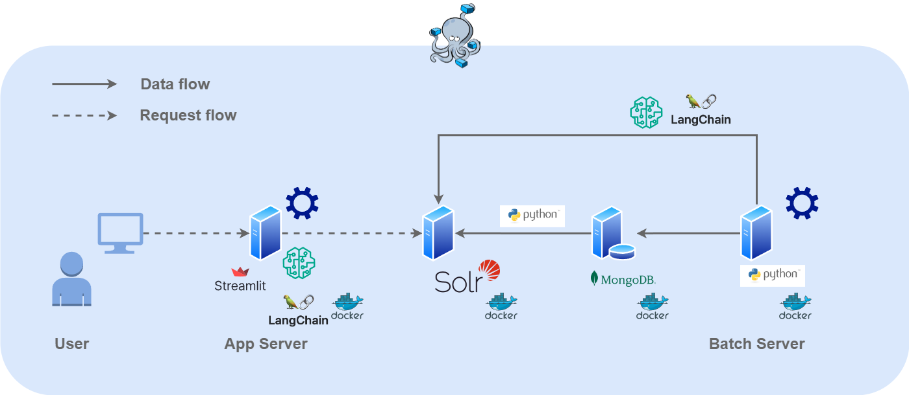

# Solr RAG Sample

## System Architecture



## Environment

The application runs Solr 10.0.0 and uses Solr's Language Models module for text embedding.

### Tools

|                | Version  |
| :------------- | :------- |
| Docker         | 20.10.21 |
| docker-compose | 1.29.2   |
| wget           | 1.20.3   |

## Embedding

Embedding is handled by Solr itself rather than by the Python application.

- Model: `BAAI/bge-m3`
- Provider: Hugging Face Inference API
- Dimension: 1024
- Similarity: cosine

Solr uses the Language Models module for both sides of the RAG flow:

1. The `textToVector` Update Request Processor converts `body` into the `vector` field during indexing.
2. The `knn_text_to_vector` query parser converts the user's query and runs KNN search against `vector`.

The Hugging Face token is therefore required by Solr, not by the Python containers.

## Prepare

If you would like to use your original data, please put `mydata.tsv` in `mysql/data/mydata` directory.

```text
mysql/
└── data/
    └── mydata/
        └── mydata.tsv
```

Set a Hugging Face API token before starting the initial setup:

```bash
export HUGGINGFACE_API_KEY=hf_xxxxxxxxxxxxxxxxxxxx
```

The default model is `BAAI/bge-m3`. It produces 1024-dimensional embeddings and does not require a `query:`/`passage:` prefix.

## Usage

```bash
# initial setup
$ make all

# start an existing setup
$ make launch

# re-index
$ make add-index
```

Access http://localhost:8501 in a browser.

## Related Documents

- [Solr でも RAG できるもん！](https://zenn.dev/sashimimochi/articles/be1122c813d989)
- [Solr でも RAG できるもん！の裏話](https://zenn.dev/sashimimochi/articles/29d78fadaf8b17)

## References

- [Apache Solr Text to Vector](https://solr.apache.org/guide/solr/10_0/query-guide/text-to-vector.html)
- [Apache Solr Solr Modules](https://solr.apache.org/guide/solr/10_0/configuration-guide/solr-modules.html)
- [Apache Solr 10.0 Upgrade Notes](https://solr.apache.org/guide/solr/10_0/upgrade-notes/major-changes-in-solr-10.html)
- [BAAI/bge-m3](https://huggingface.co/BAAI/bge-m3)
