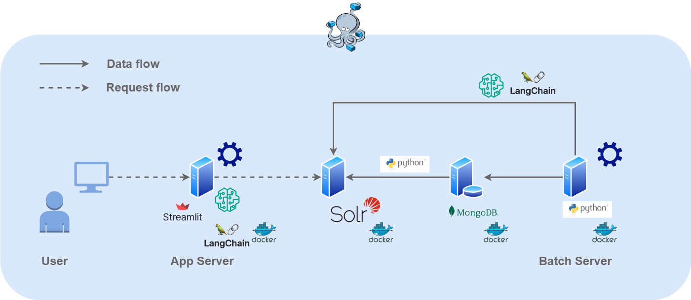

# Solr RAG Sample

## System Architecture



## Environment

### OS

The following environments have been confirmed to work.

```bash
$ cat /etc/lsb-release
DISTRIB_ID=Ubuntu
DISTRIB_RELEASE=20.04
DISTRIB_CODENAME=focal
DISTRIB_DESCRIPTION="Ubuntu 20.04.6 LTS"
```

### Machine Spec

|      | Size |
| :--- | :--- |
| RAM  | 16GB |
| VRAM | 8GB  |

### Tools

|                | Version  |
| :------------- | :------- |
| Docker         | 20.10.21 |
| docker-compose | 1.29.2   |
| wget           | 1.20.3   |

## Prepare

If you would like to use your original data, please put `mydata.tsv` in `mysql/data/mydata` directory.

```bash
$ tree mysql/
mysql/
├── conf.d
│   └── my.cnf
└── data
    └── mydata
        └── mydata.tsv
```

## Usage

```bash
# initial
$ make all
# index already exists
$ make launch
```

Access http://localhost:8501 by any Browser.

## Related Documents

- [Solr でも RAG できるもん！](https://zenn.dev/sashimimochi/articles/be1122c813d989)
- [Solr でも RAG できるもん！の裏話](https://zenn.dev/sashimimochi/articles/29d78fadaf8b17)
